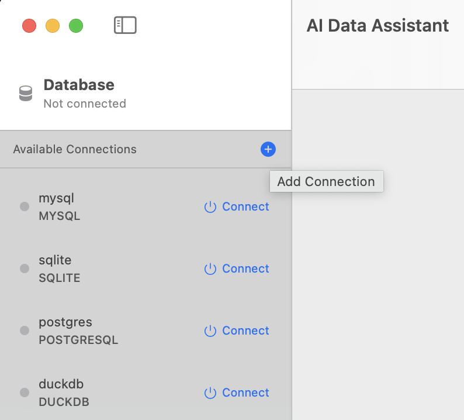
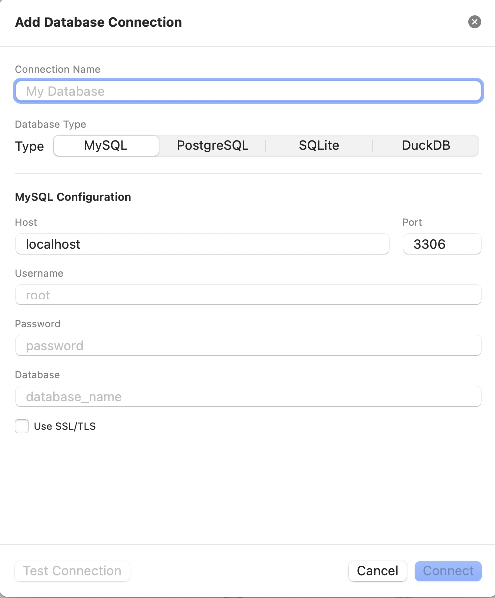
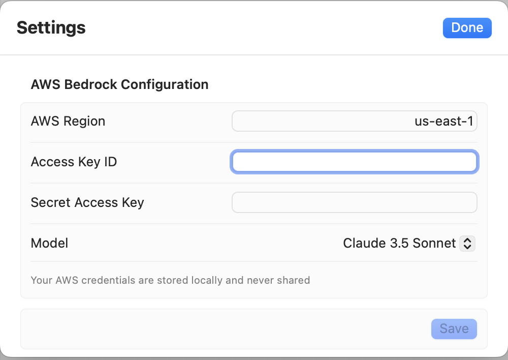
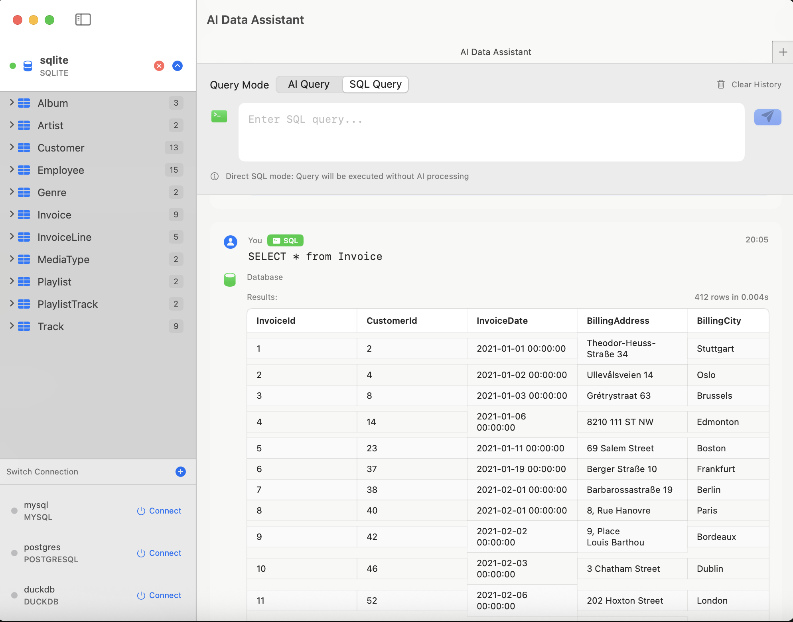
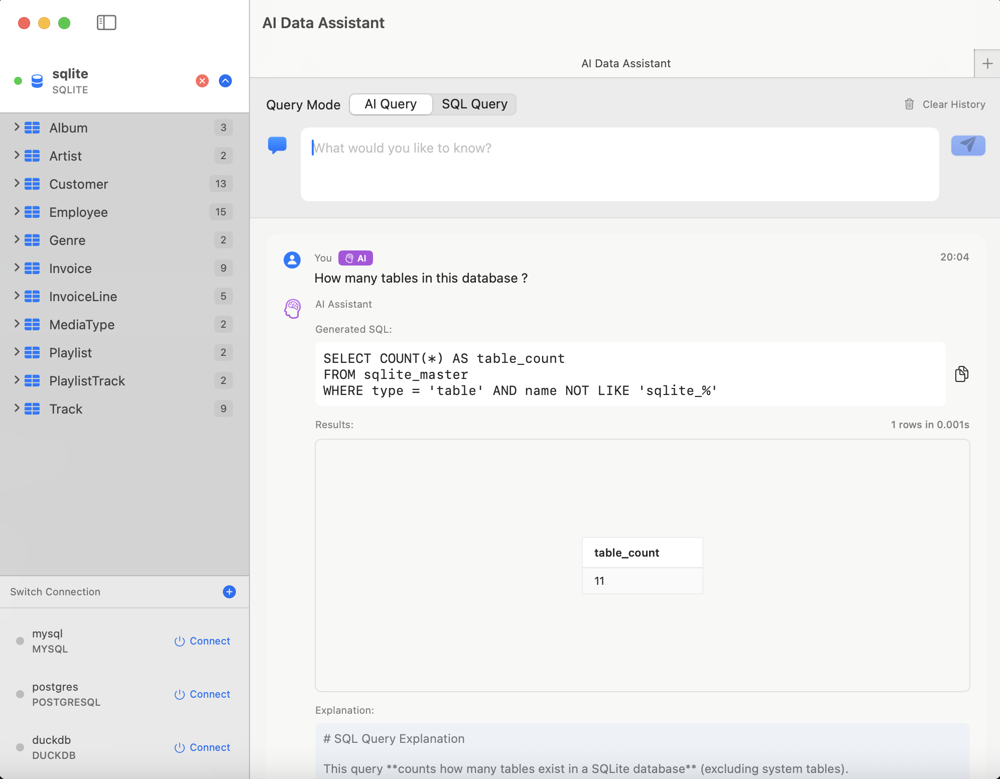

# AI Data Assistant

[中文文档](README.zh.md)

A native macOS application that enables natural language database queries powered by AI. Query your databases using everyday language - no SQL knowledge required.


## ✨ Features

- 🗣️ **Natural Language Queries** - Ask questions in plain English, get SQL results
- 🤖 **AI-Powered** - Leverages AWS Bedrock (Claude 3.5/4.5) for intelligent SQL generation
- 💾 **Multi-Database Support** - SQLite, MySQL, PostgreSQL, DuckDB
- 📊 **Smart Results Display** - Clean, tabular presentation of query results
- 💡 **Query Explanations** - AI automatically explains generated SQL queries
- 🔍 **Schema Browser** - Visual database structure exploration
- ⚡ **Direct SQL Mode** - Switch between natural language and raw SQL input

## 📸 Screenshots

### Database Configuration



### AWS Bedrock Configuration


### Query Interface



### Connection Settings


## 🛠 Tech Stack

| Component | Technology |
|-----------|------------|
| Language | Swift 5.9+ |
| UI Framework | SwiftUI |
| Platform | macOS 14.0+ (Sonoma) |
| Databases | SQLite, MySQL, DuckDB |
| AI Service | AWS Bedrock (Claude 3.5) |
| Architecture | MVVM + Protocol-Oriented |

## 🚀 Getting Started

### Prerequisites

- macOS 14.0 or later
- Xcode 15.0 or later
- AWS Account with Bedrock access
- A database to query (SQLite, MySQL, or DuckDB)

### Installation

1. **Clone the repository**
   ```bash
   git clone https://github.com/yourusername/AIDataAssistant.git
   cd AIDataAssistant
   ```

2. **Open in Xcode**
   ```bash
   open AIDataAssistant.xcodeproj
   ```

3. **Build and Run**
   - Select the `AIDataAssistant` scheme
   - Press `⌘R` to run

### Configuration

1. Launch the app and click **"Add Connection"**
2. Configure your database:
   - **SQLite**: Browse to select your `.db` file
   - **MySQL**: Enter host, port, username, password, and database name
   - **DuckDB**: Select in-memory or file mode, attach Parquet/CSV/JSON files
3. Configure AWS Bedrock:
   - Enter your AWS Region (e.g., `us-east-1`)
   - Enter AWS Access Key ID and Secret Access Key
   - Select AI model (recommended: Claude 3.5 Sonnet)
4. Click **"Connect"**

## 💬 Usage Examples

Once connected, try these natural language queries:

```
"Show all users"
"How many orders were placed last week?"
"Top 10 products by sales"
"List customers who haven't ordered in 30 days"
"Average order value by category"
```

## 🏗 Project Structure

```
AIDataAssistant/
├── Sources/Core/           # Core library
│   ├── Models/             # Data models
│   ├── Database/           # Database adapters
│   ├── AI/                 # AI service integrations
│   └── QueryEngine/        # Query processing engine
├── AIDataAssistantApp/     # macOS application
│   ├── Views/              # SwiftUI views
│   └── Assets.xcassets/    # App resources
└── Tests/                  # Unit tests
```

## 🔧 Development

### Build
```bash
swift build
```

### Test
```bash
swift test
```

## 📋 Roadmap

- [x] SQLite support
- [x] MySQL support
- [x] DuckDB support
- [ ] PostgreSQL support
- [ ] OpenAI integration
- [ ] Google Gemini integration
- [ ] Data visualization
- [ ] Export results to CSV/Excel

## 📄 License

This project is licensed under the MIT License - see the [LICENSE](LICENSE) file for details.

## 🤝 Contributing

Contributions are welcome! Please feel free to submit a Pull Request.

## 📧 Contact

For questions or issues, please [open an issue](https://github.com/yourusername/AIDataAssistant/issues) on GitHub.

